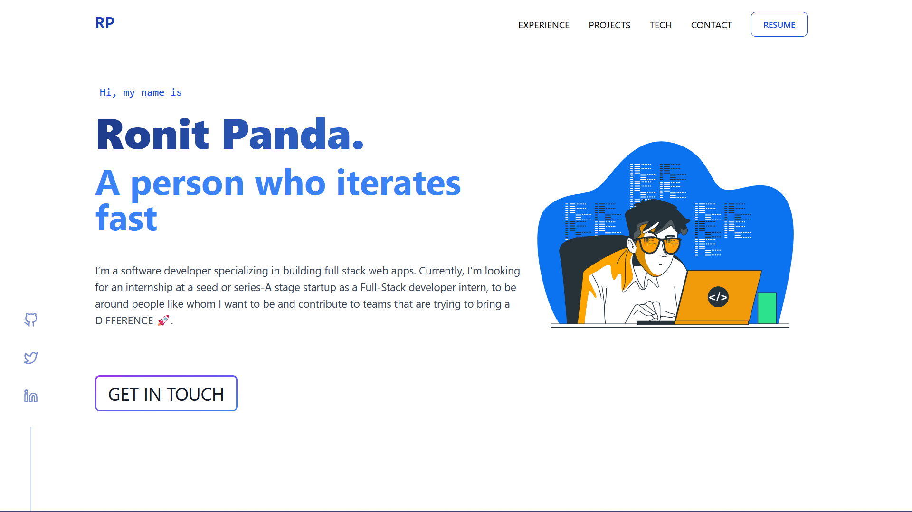

# RP

RP is a minimal, fast and beautiful portfolio website to flaunt my personal projects and work experience in tech. I have taken design inspiration from Britanny Chiang's portfolio website, with a lot of tweaks of my own. To visit and explore the website, click [here](https://ronit.pro)

Currently, I’m looking for an internship at a seed or series-A stage startup as a Full-Stack developer intern. If that rings a bell, please reach out to me via [email](mailto:pandaronit25@gmail.com).

## Socials

- [LinkedIn](https://www.linkedin.com/in/rtpa25/)
- [Twitter](https://twitter.com/panda_ronit)
- [GitHub](https://github.com/rtpa25)
